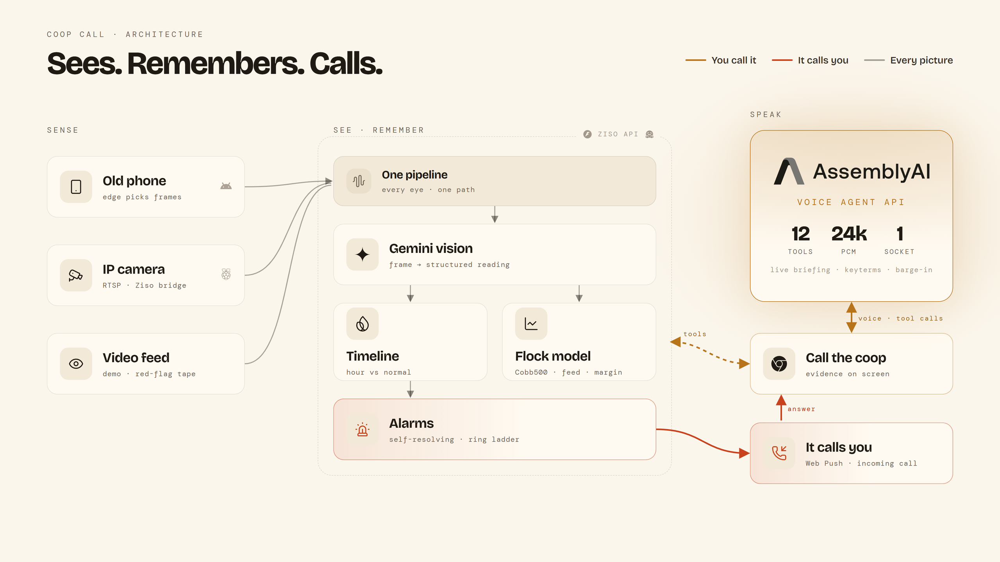

# Coop Call

Call your chicken coop. It tells you what happened, what is happening, and what to change. When something goes wrong, it calls you.

**Live:** [coopcall.web.app](https://coopcall.web.app). Press **See the demo**, then **Call the coop**.

Coop Call is the first place built on **Ziso** (Shona for *eye*). An old Android phone watches the coop. Gemini turns what it sees into a timeline. An AssemblyAI voice agent answers for the coop, in your browser.

Built for the AssemblyAI Voice Agent Hackathon, September 2026.

## How it works

<picture>
  <source media="(prefers-color-scheme: dark)" srcset="docs/architecture.png">
  
</picture>

1. **Sense.** A phone in the coop opens `/node/<coop>` in Chrome. It watches and listens, and decides on the device what is worth sending: a frame when the scene changes or a minute passes, a heartbeat with light, sound and battery every 30 seconds.
2. **See.** Gemini reads each frame into a structured observation: bird count, how the flock is spread, activity, panting, feeder and drinker levels, and anything unusual.
3. **Remember.** Observations land in Firestore and fold into hourly rollups. Each hour is compared with the same hour on earlier days.
4. **Talk.** "Call the coop" opens a live voice session with AssemblyAI's Voice Agent API. The agent answers through twelve tools over the timeline and the flock model (`coop_now`, `coop_period`, `show_picture`, `sell_plan` and more), and every picture it cites appears on screen as evidence.
5. **Push.** Two readings in a row of an empty drinker, a huddled flock or heat stress raise an alarm. Anything unusual, such as a bird down, raises one at once, and two clear pictures in a row close it. The coop rings the owner's phone with a Web Push notification styled as an incoming call. Answering opens the call with the alarm and the picture from that moment. Unanswered, it rings again every three minutes, up to four rings: the owner first, then the whole team.

## The business behind the voice

The voice on the call works from a model of the broiler business.

- **The flock.** Age, feed phase, birds alive, and estimated weight against the Cobb500 day-by-day curve, scaled by the farm's own weigh-ins.
- **The feed.** What the birds should eat today in kilos and bags, what was bought, what is on hand, and how many days it lasts. The last two weeks before selling eat about two thirds of a 35-day batch's feed, and the coop says so before the cash is needed.
- **The money.** Spend to date and a projected margin for every sell day from 30 to 49, including what one more day is worth (weight gained minus feed eaten).
- **The routine.** Vaccines due, feed phase switches, weigh days, brooding temperature and lighting for today's age.
- **The records.** Tell the coop "I bought ten bags of finisher for 310 dollars" and it reads the record back, waits for a yes, and books it.
- **The phone.** Battery, charging, network, whether the view is clear or blocked, and whether pictures are being read.

Every call starts with a briefing built from all of the above. Twelve tools let the agent look deeper while it talks.

## Quick start: pair an Android phone

1. Open [coopcall.web.app](https://coopcall.web.app) and press **Sign in to connect your own coop** (Google sign-in).
2. On **Your farm**, press **Add a coop** and name it. Leave **Let the camera estimate** chosen and the coop counts the birds and reads their age from its first pictures, or choose **I know my flock** to enter them.
3. Press **Create and connect a camera**. The coop opens on its **Camera** sheet with three ways to connect: **A phone**, **An IP camera** (through the Ziso bridge) or **A video feed**. Choose **A phone**, then **Show the code**.
4. On the phone that will live in the coop, scan the code with the camera app. The link opens in Chrome. Allow the camera and microphone, then press **Start watching**. The screen stays on while it watches.
5. Mount the phone where it sees the birds, the feeder and the drinker, and keep it on a charger.
6. On your own phone, open the coop, then **Camera**, and press **Let the coop call me**, so alarms ring you like a call.

Within a minute the dashboard shows the first picture and what Gemini read in it. Left to itself, the coop estimates the flock's size and age from the camera. To stop, press **Disconnect this phone** on the coop phone or **Disconnect** in the Camera sheet; either one retires the pairing link. For an IP camera, choose **An IP camera** instead: it gives the command for the [Ziso bridge](bridge/README.md) with the pairing link filled in. To remove a coop for good, the owner opens **Team** and presses **Delete this coop**.

## Try it with a video feed

On any coop you own, open **Camera** and pick a feed. **Connect the video feed** plays broiler-house footage from Pexels. **Connect the red-flag tape** plays a loop in order, one picture a minute: a bird down among the flock for four pictures, then the house clear. The coop calls you when it sees the bird and closes the alarm when the floor is clear again. The loop runs 40 minutes and calls once each time round. Turn on **Let the coop call me** first, or keep the page open and it rings there.

The tape's frames are from "Broilerihalli Isossakyrössä" by Oikeutta eläimille (Animal Rights Finland), CC BY 3.0, via Wikimedia Commons, resized and silent.

Growth and feed targets: Cobb500 Broiler Performance and Nutrition Supplement (2022). Default prices are Zimbabwe figures from September 2026 and are editable per flock.

## Layout

```
api/       FastAPI on a Hugging Face Space: ingest, vision, timeline, tools, alarms, voice sessions
web/       React on Firebase Hosting: landing, dashboard and call, the coop phone, the incoming call
bridge/    any RTSP camera (Tapo, Imou, EZVIZ, Hikvision) as a coop camera, with optional sensors
scripts/   deploy the API, generate push keys, create the demo coop
```

## Run it locally

```bash
cp .env.example .env              # add the AssemblyAI and Gemini keys, and a Firebase service account path
python -m venv api/.venv && api/.venv/Scripts/pip install -r api/requirements.txt
python scripts/vapid.py           # push keys for the ring
api/.venv/Scripts/python -m uvicorn app.main:app --app-dir api --port 7860
npm --prefix web install && npm --prefix web run dev
```

Create the public demo coop and connect it to the broiler-house footage (`--upload <folder>` puts the clips in Storage first):

```bash
api/.venv/Scripts/python scripts/demo_coop.py --owner-uid <firebase uid>
```

## Deploy

```bash
api/.venv/Scripts/python scripts/deploy_api.py                 # API on the Hugging Face Space
npm --prefix web run build && firebase deploy --only hosting:coopcall   # web at https://coopcall.web.app
```

## Stack

AssemblyAI Voice Agent API · Gemini 3.5 Flash-Lite · Firebase Auth, Firestore and Storage · FastAPI on Hugging Face Spaces · React on Firebase Hosting · Web Push

## Licence

MIT. See [LICENSE](LICENSE). Footage credits: broiler-house clips from Pexels (Pexels licence); red-flag frames from "Broilerihalli Isossakyrössä" by Oikeutta eläimille, CC BY 3.0.
